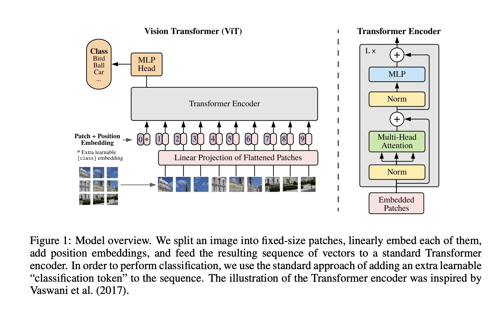

# Vision Transformer (ViT) - README

## Paper Summary

**Title**: An Image is Worth 16x16 Words: Transformers for Image Recognition at Scale  
**Authors**: Alexey Dosovitskiy, Lucas Beyer, Alexander Kolesnikov, Dirk Weissenborn, Xiaohua Zhai, Thomas Unterthiner, Mostafa Dehghani, Matthias Minderer, Georg Heigold, Sylvain Gelly, Jakob Uszkoreit, Neil Houlsby  
**Affiliation**: Google Research, Brain Team  
**Published**: ICLR 2021  
**Link**: [arXiv:2010.11929](https://arxiv.org/abs/2010.11929)  
**Code**: [github.com/google-research/vision_transformer](https://github.com/google-research/vision_transformer)

### Overview
The Vision Transformer (ViT) adapts the Transformer architecture—originally designed for NLP—to image recognition, bypassing traditional convolutional neural networks (CNNs). Images are split into fixed-size patches (e.g., 16x16), treated as a sequence, and processed by a standard Transformer encoder. Pre-trained on large datasets (e.g., JFT-300M) and fine-tuned on smaller benchmarks (e.g., ImageNet), ViT achieves state-of-the-art performance with fewer computational resources than CNNs.



### Key Findings
- **Performance**: ViT-H/14 achieves 88.55% on ImageNet, 94.55% on CIFAR-100, and 77.63% on VTAB (19 tasks) when pre-trained on JFT-300M.
- **Efficiency**: Requires 2.5k TPUv3-core-days vs. 9.9k for BiT-L (ResNet152x4).
- **Data Dependence**: Excels with large-scale pre-training but underperforms on small datasets without regularization due to minimal inductive biases.
- **Scalability**: Larger models and datasets improve results without saturation.

### Contributions
- Demonstrates a pure Transformer can replace CNNs for vision tasks.
- Shows large-scale pre-training compensates for lack of image-specific biases.
- Provides open-source code and pre-trained models.

---

## Architecture Details

### Image to Sequence Transformation
An image \( \mathbf{x} \in \mathbb{R}^{H \times W \times C} \) is divided into \( N = \frac{HW}{P^2} \) patches of size \( P \times P \) (e.g., 16x16).

- **Patch Flattening**: Each patch is flattened to \( P^2 \cdot C \) (e.g., 768 for RGB with \( P = 16 \)).
- **Linear Projection**: A trainable matrix \( \mathbf{E} \in \mathbb{R}^{(P^2 \cdot C) \times D} \) projects patches to \( D \)-dimensional embeddings:
  \[
  \mathbf{x}_p^i \mathbf{E}
  \]
- **Position Embeddings**: Learnable 1D embeddings \( \mathbf{E}_{\text{pos}} \in \mathbb{R}^{(N+1) \times D} \) are added.
- **Classification Token**: A learnable \( \mathbf{x}_{\text{class}} \) is prepended.

Initial sequence:
\[
\mathbf{z}_0 = [\mathbf{x}_{\text{class}}; \mathbf{x}_p^1 \mathbf{E}; \mathbf{x}_p^2 \mathbf{E}; \dots; \mathbf{x}_p^N \mathbf{E}] + \mathbf{E}_{\text{pos}}
\]

### Transformer Encoder
Consists of \( L \) layers, each with:
- **Multi-Head Self-Attention (MSA)**:
  - Queries, keys, values:
    \[
    [\mathbf{q}, \mathbf{k}, \mathbf{v}] = \mathbf{z}_{\ell-1} \mathbf{U}_{qkv}, \quad \mathbf{U}_{qkv} \in \mathbb{R}^{D \times 3D_h}
    \]
    where \( D_h = \frac{D}{k} \), \( k \) is the number of heads.
  - Attention weights:
    \[
    A = \text{softmax}\left(\frac{\mathbf{q} \mathbf{k}^\top}{\sqrt{D_h}}\right), \quad A \in \mathbb{R}^{N \times N}
    \]
  - Single-head output:
    \[
    \text{SA}(\mathbf{z}_{\ell-1}) = A \mathbf{v}
    \]
  - Multi-head output:
    \[
    \text{MSA}(\mathbf{z}_{\ell-1}) = [\text{SA}_1; \text{SA}_2; \dots; \text{SA}_k] \mathbf{U}_{msa}, \quad \mathbf{U}_{msa} \in \mathbb{R}^{k \cdot D_h \times D}
    \]
  - With LayerNorm and residual:
    \[
    \mathbf{z}_{\ell}' = \text{MSA}(\text{LN}(\mathbf{z}_{\ell-1})) + \mathbf{z}_{\ell-1}
    \]
- **MLP Block**: Two layers with GELU:
  \[
  \mathbf{z}_{\ell} = \text{MLP}(\text{LN}(\mathbf{z}_{\ell}')) + \mathbf{z}_{\ell}'
  \]
- **Output**: Classification token after \( L \) layers:
  \[
  \mathbf{y} = \text{LN}(\mathbf{z}_L^0)
  \]

### Model Variants
| Model     | Layers | \( D \) | MLP Size | Heads | Params |
|-----------|--------|---------|----------|-------|--------|
| ViT-Base  | 12     | 768     | 3072     | 12    | 86M    |
| ViT-Large | 24     | 1024    | 4096     | 16    | 307M   |
| ViT-Huge  | 32     | 1280    | 5120     | 16    | 632M   |

Patch size (e.g., /16) affects \( N \) and compute cost.

---

## Training Details

### Pre-training
- **Datasets**: ImageNet (1.3M), ImageNet-21k (14M), JFT-300M (303M).
- **Optimizer**: Adam (\( \beta_1 = 0.9, \beta_2 = 0.999 \)), batch size 4096, weight decay 0.1.
- **Learning Rate**: Linear warmup (10k steps) and decay (e.g., \( 8 \times 10^{-4} \) for ViT-B/16 on JFT).
- **Resolution**: 224x224.

### Fine-tuning
- **Head**: Pre-trained head replaced with zero-initialized linear layer for \( K \) classes.
- **Optimizer**: SGD with momentum 0.9, batch size 512.
- **Learning Rate**: Swept (e.g., \{0.003, 0.01, 0.03\}), cosine decay.
- **Resolution**: Increased (e.g., 384x384 or 512x512), with 2D-interpolated position embeddings.

### Self-Supervision (Exploratory)
- **Task**: Masked patch prediction (50% patches corrupted: 80% masked, 10% random, 10% unchanged).
- **Target**: Predict 3-bit mean color (512 classes).
- **Training**: 1M steps on JFT, Adam (\( 2 \times 10^{-4} \)).
- **Result**: ViT-B/16 achieves 79.9% on ImageNet (2% gain over scratch, 4% below supervised).

### No Semi-Supervised Training
- ViT uses supervised pre-training and fine-tuning.
- Semi-supervised methods (e.g., Noisy Student) are referenced for comparison but not implemented.

---

## Results

### Performance Comparison
| Model             | Dataset       | ImageNet | CIFAR-100 | VTAB  | TPUv3-core-days |
|-------------------|---------------|----------|-----------|-------|-----------------|
| ViT-H/14         | JFT-300M      | 88.55    | 94.55     | 77.63 | 2.5k            |
| ViT-L/16         | JFT-300M      | 87.76    | 93.90     | 76.28 | 0.68k           |
| ViT-L/16         | ImageNet-21k  | 85.30    | 93.25     | 72.72 | 0.23k           |
| BiT-L (ResNet)   | JFT-300M      | 87.54    | 93.51     | 76.29 | 9.9k            |
| Noisy Student    | JFT-300M      | 88.5     | -         | -     | 12.3k           |

### Insights
- ViT outperforms CNNs with less compute when pre-trained on large datasets.
- Struggles on small datasets (e.g., ImageNet alone) without regularization.

---

## Key Analyses
- **Attention**: Some heads attend globally even in early layers; attention distance grows with depth.
- **Scaling**: Depth > width for performance; larger models/datasets improve results.
- **Inductive Bias**: ViT has less bias (e.g., no locality) than CNNs, relying on data scale.

---

## Limitations & Future Work
- Poor performance on small datasets without heavy regularization.
- Untested on detection/segmentation (though DETR suggests promise).
- Self-supervised pre-training lags behind supervised (gap of 4% on ImageNet).

---

## How to Use
1. **Install**: Clone the repo and install dependencies:
   ```bash
   git clone https://github.com/google-research/vision_transformer
   pip install -r requirements.txt


---
@inproceedings{dosovitskiy2021image,
  title={An Image is Worth 16x16 Words: Transformers for Image Recognition at Scale},
  author={Dosovitskiy, Alexey and Beyer, Lucas and Kolesnikov, Alexander and Weissenborn, Dirk and Zhai, Xiaohua and Unterthiner, Thomas and Dehghani, Mostafa and Minderer, Matthias and Heigold, Georg and Gelly, Sylvain and Uszkoreit, Jakob and Houlsby, Neil},
  booktitle={International Conference on Learning Representations (ICLR)},
  year={2021}
}

