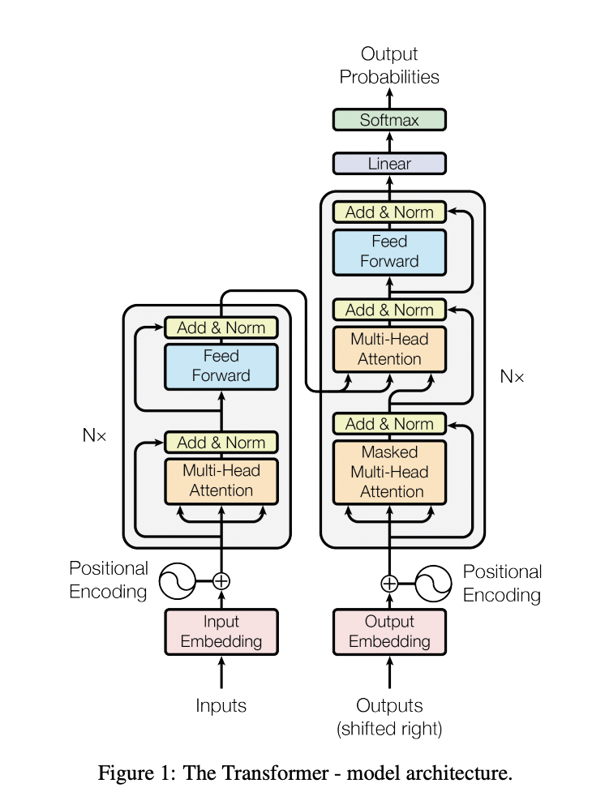

# Understanding "Attention Is All You Need" in Detail

[Paper Link](https://arxiv.org/pdf/1706.03762)

[git_hub](https://github.com/tensorflow/tensor2tensor)

---

## Overview of the Transformer

The Transformer is designed for sequence transduction, converting an input sequence (e.g., an English sentence) into an output sequence (e.g., a German sentence). It uses an encoder-decoder architecture based entirely on attention, avoiding RNNs and convolutions.

- **Encoder**: Processes the input sequence into a continuous representation.
- **Decoder**: Generates the output sequence from the encoder’s representation.
- Both consist of 6 identical layers (in the base model), with attention and feed-forward networks as key components.

---

## Key Concepts and Mathematics

### 1. Scaled Dot-Product Attention

The core mechanism of the Transformer, computing how much focus each word gives to others.

#### Inputs
- **Queries (Q)**: Matrix of size $(n × d_k)$ - What we're looking for.
- **Keys (K)**: Matrix of size $(n × d_k)$ - What we compare against.
- **Values (V)**: Matrix of size $(n × d_v)$ - What we retrieve.
- Where:
  - $n$: Sequence length.
  - $d_k$: Key/query dimension.
  - $d_v$: Value dimension.

#### Formula
%20=%20\text{softmax}\left(\frac{Q%20K^T}{\sqrt{d_k}}\right)%20V)

- Q $K^T$: Dot product similarity ($ n × n $ matrix).
- $\begin \frac{1}{\sqr{d_K}}$
- **$ 1 / √d_k $**: Scales to prevent large values from skewing softmax gradients.
- **$ softmax $**: Normalizes scores into probabilities.
- Multiply by **$ V $**: Weights values, output is `n × d_v`.

#### Intuition
For "The cat sleeps," the query for "sleeps" finds "cat" relevant via keys and retrieves info from values.

#### Numerical Example
Let’s compute attention for a tiny sequence: "The cat" (\( n = 2 \)), with \( d_k = d_v = 2 \) for simplicity.

- **Inputs**:
  - \( Q = \begin{bmatrix} 1 & 0 \\ 0 & 1 \end{bmatrix} \) (queries for "The" and "cat").
  - \( K = \begin{bmatrix} 1 & 0 \\ 0 & 1 \end{bmatrix} \) (keys, same as queries for self-attention).
  - \( V = \begin{bmatrix} 2 & 3 \\ 4 & 5 \end{bmatrix} \) (values representing "The" and "cat").

- **Why \( d_k = d_v = 2 \)?**:
  - **Minimal Size**: \( n = 2 \) is the smallest interesting sequence. \( d_k = 1 \) would give scalars, while \( d_k = 2 \) provides vectors, showing interactions like in the real model.
  - **Simplicity**: Keeps matrices small (e.g., \( 2 \times 2 \)) for hand calculation, unlike \( d_k = 64 \) in the Transformer.
  - **Consistency**: \( d_v = d_k \) mirrors the paper’s design, simplifying the example.

- **How Matrices Were Decided**:
  - **\( Q \) and \( K \)**: \( \begin{bmatrix} 1 & 0 \\ 0 & 1 \end{bmatrix} \) uses orthogonal vectors (\( [1, 0] \) for "The", \( [0, 1] \) for "cat") to control similarity (e.g., "The" matches itself, not "cat"). In self-attention, \( Q = K \) simplifies the example.
  - **\( V \)**: \( \begin{bmatrix} 2 & 3 \\ 4 & 5 \end{bmatrix} \) uses distinct, small integers to show mixing. \( [2, 3] \) and \( [4, 5] \) represent "content" for "The" and "cat", chosen arbitrarily but to be different and simple.

- **Step 1: Compute \( Q K^T \)**:
  \[
  Q K^T = \begin{bmatrix} 1 & 0 \\ 0 & 1 \end{bmatrix} \begin{bmatrix} 1 & 0 \\ 0 & 1 \end{bmatrix} = \begin{bmatrix} 1 & 0 \\ 0 & 1 \end{bmatrix}
  \]
  - "The" to "The": \( 1 \cdot 1 + 0 \cdot 0 = 1 \).
  - "The" to "cat": \( 1 \cdot 0 + 0 \cdot 1 = 0 \).

- **Step 2: Scale by \( \sqrt{d_k} = \sqrt{2} \approx 1.414 \)**:
  \[
  \frac{Q K^T}{\sqrt{d_k}} = \begin{bmatrix} 1 / 1.414 & 0 / 1.414 \\ 0 / 1.414 & 1 / 1.414 \end{bmatrix} = \begin{bmatrix} 0.707 & 0 \\ 0 & 0.707 \end{bmatrix}
  \]
  - Scaling reduces large values, stabilizing gradients.

- **Step 3: Apply Softmax (per row)**:
  - **What Is Softmax?**: Turns raw scores into probabilities summing to 1 using \( \text{softmax}(x_i) = \frac{e^{x_i}}{\sum e^{x_j}} \), where \( e \approx 2.718 \).
  - **Row 1: \( \text{softmax}(0.707, 0) \)**:
    1. **Exponentiate**:
       - \( e^{0.707} \):
         - \( e \approx 2.718 \) is Euler’s number.
         - \( e^{0.707} = 2.718^{0.707} \approx 2.027 \) (between \( e^0 = 1 \) and \( e^1 = 2.718 \)).
       - \( e^0 = 1 \) (any number to power 0 is 1).
       - Result: \( [0.707, 0] \) → \( [2.027, 1] \).
    2. **Sum**: \( 2.027 + 1 = 3.027 \).
    3. **Normalize**:
       - \( \frac{2.027}{3.027} \approx 0.6699 \approx 0.67 \).
       - \( \frac{1}{3.027} \approx 0.3300 \approx 0.33 \).
    4. **Result**: \( [0.67, 0.33] \) ("The" attends 67% to itself, 33% to "cat").
  - **Row 2: \( \text{softmax}(0, 0.707) \)**:
    1. **Exponentiate**: \( e^0 = 1 \), \( e^{0.707} \approx 2.027 \).
    2. **Sum**: \( 1 + 2.027 = 3.027 \).
    3. **Normalize**:
       - \( \frac{1}{3.027} \approx 0.33 \).
       - \( \frac{2.027}{3.027} \approx 0.67 \).
    4. **Result**: \( [0.33, 0.67] \) ("cat" attends 33% to "The", 67% to itself).
  - **Attention Scores**: \( \begin{bmatrix} 0.67 & 0.33 \\ 0.33 & 0.67 \end{bmatrix} \).

- **Step 4: Multiply by \( V \)**:
  \[
  \text{Attention}(Q, K, V) = \begin{bmatrix} 0.67 & 0.33 \\ 0.33 & 0.67 \end{bmatrix} \begin{bmatrix} 2 & 3 \\ 4 & 5 \end{bmatrix} = \begin{bmatrix} (0.67 \cdot 2 + 0.33 \cdot 4) & (0.67 \cdot 3 + 0.33 \cdot 5) \\ (0.33 \cdot 2 + 0.67 \cdot 4) & (0.33 \cdot 3 + 0.67 \cdot 5) \end{bmatrix} = \begin{bmatrix} 2.66 & 3.66 \\ 3.34 & 4.34 \end{bmatrix}
  \]
  - Output for "The": \( [2.66, 3.66] \), mixing "The" and "cat".

### 2. Multi-Head Attention

Uses multiple attention "heads" to capture different relationships.

#### Process
- Split \( Q \), \( K \), \( V \) into \( h \) heads (e.g., \( h = 8 \)).
- For each head \( i \):
  - Project: \( Q W_i^Q \), \( K W_i^K \), \( V W_i^V \) (to \( d_k = d_v = d_{\text{model}} / h = 64 \)).
  - Compute: \( \text{head}_i = \text{Attention}(Q W_i^Q, K W_i^K, V W_i^V) \).
- Concatenate:
  %20=%20\text{Concat}(\text{head}_1,%20\ldots,%20\text{head}_h)%20W^O)

#### Why?
Each head focuses on different aspects (e.g., syntax, semantics).

### 3. Positional Encoding

Adds sequence order info since there’s no recurrence.

#### Formula
}%20=%20\sin\left(\frac{pos}{10000^{2i%20/%20d_{\text{model}}}}\right),%20PE_{(pos,%202i+1)}%20=%20\cos\left(\frac{pos}{10000^{2i%20/%20d_{\text{model}}}}\right))

- \( pos \): Position (0, 1, 2, …).
- \( i \): Dimension index (0 to \( d_{\text{model}}/2 - 1 \)).

#### Intuition
Sinusoids encode position uniquely, enabling generalization.

### 4. Feed-Forward Networks (FFN)

Applied position-wise in each layer:
%20=%20\max(0,%20x%20W_1%20+%20b_1)%20W_2%20+%20b_2)

- Input/output: \( d_{\text{model}} = 512 \).
- Inner layer: \( d_{ff} = 2048 \).

### 5. Layer Normalization and Residual Connections

- **Residual**: \( x + \text{Sublayer}(x) \) - Adds input to output, aiding gradient flow.
- **LayerNorm**: Normalizes across features for stability.

### 6. Decoder Masking

Masks future positions in decoder self-attention (sets to \(-\infty\)) to enforce auto-regressive generation.

---

## Architecture Recap

### Encoder Layers (6 Identical Layers)
Each layer processes the input sequence:
1. **Multi-Head Self-Attention**:
   - Each word attends to all input words.
   - 8 heads, each with \( d_k = d_v = 64 \), output concatenated to 512 dims.
   - Residual: \( x + \text{Attention}(x) \).
   - LayerNorm: Normalizes result.
2. **Feed-Forward Network**:
   - \( \text{FFN}(x) = \max(0, x W_1 + b_1) W_2 + b_2 \).
   - \( d_{ff} = 2048 \), output 512 dims.
   - Residual: \( x + \text{FFN}(x) \).
   - LayerNorm: Normalizes result.

### Decoder Layers (6 Identical Layers)
Each layer generates the output sequence:
1. **Masked Multi-Head Self-Attention**:
   - Attends to previous output positions only (masked future).
   - 8 heads, 512-dim output.
   - Residual + LayerNorm.
2. **Multi-Head Attention Over Encoder Output**:
   - \( Q \) from decoder, \( K \), \( V \) from encoder.
   - Links input and output sequences.
   - Residual + LayerNorm.
3. **Feed-Forward Network**:
   - Same as encoder FFN.
   - Residual + LayerNorm.

### Flow
- Encoder: Input embeddings + PE → 6 layers → output.
- Decoder: Output embeddings + PE → 6 layers → linear + softmax.

---

## Understanding the Plots

### Layer Context
The Transformer has 6 encoder and 6 decoder layers:
- **Layer 1**: First layer, processes raw input (encoder) or output embeddings (decoder).
- **Layer 2-4**: Intermediate layers, refining representations.
- **Layer 5**: Fifth layer, deep enough for complex patterns, often analyzed for insights (second-to-last).
- **Layer 6**: Final layer, produces encoder output or final prediction probabilities.

### Figure 1: Transformer Model Architecture

- **Description**: Encoder (left), decoder (right) stacks.
- **Key Elements**: 
  - Encoder: 6 layers, each with self-attention and FFN, transforming input embeddings + positional encoding.
  - Decoder: 6 layers with masked self-attention, encoder attention, and FFN, plus a final linear layer and softmax for predictions.
- **Layer Positions in the Plot**:
  - **Encoder (Left Stack)**:
    - **Layer 1**: Bottom-most block, directly above "Input Embedding + Positional Encoding" (starts processing input).
    - **Layer 2**: Second block from the bottom.
    - **Layer 3**: Third block from the bottom.
    - **Layer 4**: Fourth block from the bottom.
    - **Layer 5**: Fifth block from the bottom (refines patterns).
    - **Layer 6**: Top-most block (final encoder output to decoder).
  - **Decoder (Right Stack)**:
    - **Layer 1**: Bottom-most block, above "Output Embedding + Positional Encoding" (starts with masked self-attention).
    - **Layer 2**: Second block from the bottom.
    - **Layer 3**: Third block from the bottom.
    - **Layer 4**: Fourth block from the bottom.
    - **Layer 5**: Fifth block from the bottom (analyzed in Figures 3-5).
    - **Layer 6**: Top-most block, below "Linear" and "Softmax" (final prediction).

### Figure 2: Scaled Dot-Product and Multi-Head Attention
- **Left**: Scaled dot-product process (e.g., \( \text{softmax}(Q K^T / \sqrt{d_k}) V \)).
- **Right**: Multi-head parallelism (multiple attention heads computed simultaneously).

### Figure 3: Attention Example (Layer 5)
- **Description**: Attention weights for "making" (e.g., in "making…more difficult") from the fifth decoder layer.
- **Insight**: Layer 5 captures long-distance dependencies.

### Figure 4: Anaphora Resolution (Layer 5)
- **Description**: "its" attention weights from the fifth decoder layer, resolving pronouns.
- **Insight**: Links pronouns to antecedents.

### Figure 5: Sentence Structure (Layer 5)
- **Description**: Attention heads in the fifth decoder layer learn distinct tasks (syntax vs. semantics).
- **Insight**: Specialization by Layer 5.

---

## Why It Works

- **Parallelization**: Trains faster (e.g., 12 hours).
- **Long-Range Dependencies**: \( O(1) \) steps.
- **Performance**: 28.4 BLEU (EN-DE), 41.8 BLEU (EN-FR).

---

